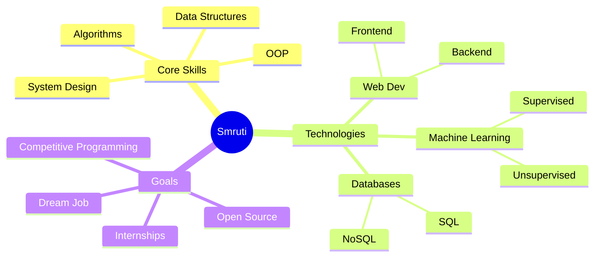

<!-- ======= HERO SECTION ======= -->
<div align="center">
  
  <!-- Animated Banner -->
  
  
  <!-- Glowing Title -->
  <div>
    
  </div>
  
  <!-- Animated Subtitle -->
  
  
  <!-- Glowing Divider -->
  
  
</div>

<!-- ======= PROFILE BADGES ======= -->
<div align="center">
  
  <!-- Status Badges -->
  
  
  
  
  
  <br><br>
  
  <!-- Social Links with Glow Effect -->
  <a href="https://www.linkedin.com/in/smruti-parhi-35396b231">
    
  </a>
  <a href="mailto:smrutiparhi81@gmail.com">
    
  </a>
  <a href="https://github.com/smrutiparhi">
    
  </a>
  <a href="#">
    
  </a>
  
  <br><br>
  
  <!-- Profile Stats -->
  
  
  
  
</div>

<br>

<!-- ======= ANIMATED DIVIDER ======= -->


<br>

<!-- ======= ABOUT SECTION ======= -->
<div align="center">
  
  ## 🌟 『 ABOUT ME 』 🌟
  
</div>


```typescript
class Developer {
    name: string = "Smruti Ranjan Parhi";
    location: string = "Hyderabad, India 🇮🇳";
    education: string = "B.Tech CSE @ KL University";
    year: number = 2;
    
    skills: string[] = [
        "Problem Solving 🧩",
        "Clean Code Architecture 🏗️",
        "Full-Stack Development 🌐",
        "AI/ML Innovation 🤖"
    ];
    
    currentlyLearning: string[] = [
        "Advanced DSA",
        "System Design",
        "Machine Learning",
        "Cloud Technologies"
    ];
    
    goals2024: string[] = [
        "Master Competitive Programming",
        "Build Production-Level Projects",
        "Contribute to Open Source",
        "Secure Dream Internship"
    ];
    
    getMotivation(): string {
        return "Turning caffeine into code ☕ → 💻";
    }
}
```

<br clear="right"/>

### ⚡ Quick Facts

<div align="center">

| 🎯 | Focus Areas | 🚀 | Currently Working On |
|:---:|:---|:---:|:---|
| 💻 | Data Structures & Algorithms | 🌾 | KrishiMitra - Smart Agriculture |
| 🧠 | Machine Learning & AI | ❤️ | Health Prediction Systems |
| 🌐 | Full-Stack Web Development | 📱 | Interactive Web Applications |
| 🔧 | System Design & Architecture | 📚 | Competitive Programming |

</div>

<br>

<!-- ======= ANIMATED DIVIDER ======= -->


<br>

<!-- ======= TECH STACK ======= -->
<div align="center">
  
  ## 🛠️ 『 TECH ARSENAL 』 🛠️
  
  
  
</div>

### 💻 Languages

<div align="center">
  
  
  
  
  
  
  
  
</div>

### 🎨 Frontend Development

<div align="center">
  
  
  
  
  
  
  
</div>

### ⚙️ Backend & Database

<div align="center">
  
  
  
  
  
  
</div>

### 🤖 AI/ML & Data Science

<div align="center">
  
  
  
  
  
  
</div>

### 🔧 Tools & Platforms

<div align="center">
  
  
  
  
  
  
  
  
</div>

<br>

<!-- ======= ANIMATED DIVIDER ======= -->


<br>

<!-- ======= GITHUB STATS ======= -->
<div align="center">
  
  ## 📊 『 GITHUB ANALYTICS 』 📊
  
  
  
</div>

<br>

<div align="center">
  
  
  
  
</div>

<br>

<div align="center">
  
  
  
  
</div>

<br>

<div align="center">
  
  
  
</div>

<br>

<div align="center">
  
  
  
</div>

<br>

<!-- ======= ANIMATED DIVIDER ======= -->


<br>

<!-- ======= FEATURED PROJECTS ======= -->
<div align="center">
  
  ## 🚀 『 FEATURED PROJECTS 』 🚀
  
  
  
</div>

<br>

<div align="center">

<table>
<tr>
<td width="50%" valign="top">

### 🌾 KrishiMitra
**Smart Agriculture Advisory System**


Revolutionary platform empowering farmers with:
- 🌡️ Real-time weather predictions
- 🌱 Crop recommendation system
- 💧 Smart irrigation guidance
- 🐛 Pest detection using AI

**Impact:** Helping farmers make data-driven decisions

</td>
<td width="50%" valign="top">

### ❤️ Heart Disease Predictor
**ML-Based Healthcare System**


Advanced ML model for early detection:
- 🏥 90%+ accuracy prediction
- 📊 Interactive data visualization
- 🔍 Risk factor analysis
- 📱 User-friendly interface

**Impact:** Early detection saves lives

</td>
</tr>

<tr>
<td width="50%" valign="top">

### 📰 News Summary App
**Real-Time News Aggregator**


Stay informed with:
- 📱 Clean, modern interface
- ⚡ Real-time news updates
- 🎯 Category-wise filtering
- 🔍 Smart search functionality

**Impact:** Information at your fingertips

</td>
<td width="50%" valign="top">

### 💼 Portfolio Website
**Personal Brand Showcase**


Professional portfolio featuring:
- 🎨 Responsive design
- ✨ Smooth animations
- 📱 Mobile-optimized
- 🚀 Fast performance

**Impact:** Digital presence that stands out

</td>
</tr>
</table>

</div>

<div align="center">
  
  ### 📌 *Explore these projects and more in my pinned repositories below!*
  
</div>

<br>

<!-- ======= ANIMATED DIVIDER ======= -->


<br>

<!-- ======= CODING STATS ======= -->
<div align="center">
  
  ## 💻 『 CODING ACTIVITY 』 💻
  
  
  
</div>

<br>

<div align="center">
  
  
  
  <!--START_SECTION:waka-->
  <!--END_SECTION:waka-->
  
</div>

<br>

<!-- ======= ANIMATED DIVIDER ======= -->


<br>

<!-- ======= LEARNING JOURNEY ======= -->
<div align="center">
  
  ## 🎯 『 LEARNING JOURNEY 』 🎯
  
</div>

<br>

<div align="center">



</div>

<br>

<!-- ======= ANIMATED DIVIDER ======= -->


<br>

<!-- ======= ACHIEVEMENTS ======= -->
<div align="center">
  
  ## 🏆 『 ACHIEVEMENTS 』 🏆
  
  
  
</div>

<br>

<div align="center">

| Achievement | Status | Description |
|:---:|:---:|:---|
| 🎓 | **Pursuing** | B.Tech CSE @ KL University |
| 💻 | **Active** | Building Production-Level Projects |
| 🌟 | **Growing** | Contributing to Tech Community |
| 🚀 | **Learning** | Advanced DSA & System Design |
| 🤝 | **Networking** | Connecting with Industry Professionals |

</div>

<br>

<!-- ======= ANIMATED DIVIDER ======= -->


<br>

<!-- ======= QUOTE ======= -->
<div align="center">
  
  ## 💭 『 DAILY INSPIRATION 』 💭
  
</div>

<br>

<div align="center">
  
  
  
</div>

<br>

<!-- ======= ANIMATED DIVIDER ======= -->


<br>

<!-- ======= CONNECT SECTION ======= -->
<div align="center">
  
  ## 🤝 『 LET'S CONNECT 』 🤝
  
  
  
</div>

<br>

<div align="center">
  
  ### 💬 I'm always excited to collaborate on innovative projects!
  
  **Open to:**
  - 🚀 Innovative Project Collaborations
  - 💼 Internship Opportunities
  - 🤝 Open Source Contributions
  - 📚 Knowledge Sharing & Mentorship
  - 🎯 Competitive Programming Teams
  
  <br>
  
  ### 📫 Reach Out To Me:
  
  <table>
    <tr>
      <td align="center">
        <a href="mailto:smrutiparhi81@gmail.com">
          
        </a>
      </td>
    </tr>
    <tr>
      <td align="center">
        <a href="https://www.linkedin.com/in/smruti-parhi-35396b231">
          
        </a>
      </td>
    </tr>
    <tr>
      <td align="center">
        <a href="https://github.com/smrutiparhi">
          
        </a>
      </td>
    </tr>
  </table>
  
</div>

<br>

<!-- ======= ANIMATED DIVIDER ======= -->


<br>

<!-- ======= SUPPORT ======= -->
<div align="center">
  
  ## ☕ 『 SUPPORT MY WORK 』 ☕
  
  
  
  <br><br>
  
  If you find my projects helpful, consider giving them a ⭐
  
  <br>
  
  
  
  
</div>

<br>

<!-- ======= ANIMATED DIVIDER ======= -->


<br>

<!-- ======= SNAKE ANIMATION ======= -->
<div align="center">
  
  
  
</div>

<br>

<!-- ======= FOOTER ======= -->
<div align="center">
  
  
  
  <br>
  
  ### ⭐ From [smrutiparhi](https://github.com/smrutiparhi) with 💙
  
  <br>
  
  
  
  <br><br>
  
  
  
  
  
  <br>
  
  <sub>Last Updated: 2024 | Auto-generated stats update daily</sub>
  
</div>
