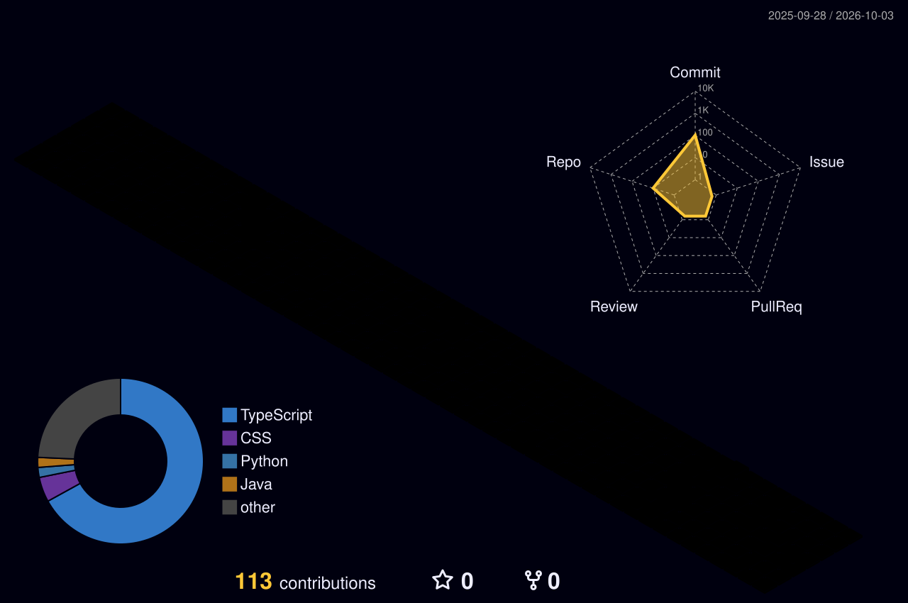

<div align="center">


<a href="https://github.com/smrutiparhi">
  
</a>

<br/>

<a href="https://smruti-portfolio.onrender.com"></a>
<a href="https://www.linkedin.com/in/smruti-parhi-35396b231"></a>
<a href="mailto:smrutiparhi81@gmail.com"></a>

</div>

---

## 👨‍💻 About

<table>
<tr>
<td width="60%" valign="top">

**B.Tech CSE** @ KL University, Hyderabad · 3rd year · CGPA 8.95

- 🔭 Building full-stack products with **React, Node.js, Express, TypeScript**
- 🧠 Applying **machine learning** to real problems
- 🎯 Looking for **Summer 2027 internships**
- 💬 Ask me about React, Node, Python, or ML

</td>
<td width="40%" valign="top">

```ts
const smruti = {
  role: "Full-Stack Developer",
  focus: ["Web", "ML", "Systems"],
  status: "Open to internships",
  loop: () => "Build • Learn • Repeat",
};
```

</td>
</tr>
</table>

---

## 🚀 Projects people remember

<table>
<tr>
<td width="50%" valign="top">

### 📱 RecoverAI
Full-stack TypeScript monorepo for lost / stolen phone recovery.

`TypeScript` `React` `Node.js`

</td>
<td width="50%" valign="top">

### 🛒 NovaCart AI
Cloud-native, AI-powered e-commerce platform.

`React` `Node.js` `Cloud` `AI`

</td>
</tr>
<tr>
<td width="50%" valign="top">

### 📄 ATS Resume Checker
Scores resumes against ATS rules and suggests fixes.

`React` `Next.js`

</td>
<td width="50%" valign="top">

### 🛰️ Satellite Anomaly Detection
Convolutional autoencoders to flag anomalies in satellite data.

`Python` `Deep Learning`

</td>
</tr>
</table>

<p align="center"><a href="https://github.com/smrutiparhi?tab=repositories"><b>All repositories →</b></a> · <a href="https://smruti-portfolio.onrender.com"><b>Live portfolio →</b></a></p>

---

## 🛠️ Tools I build with

<p align="center">
  <br/>
  
</p>

---

## 📊 Profile at a glance

<p align="center">
  
  
</p>

<p align="center">
  
</p>

---

## 🏙️ My contribution city

<p align="center">
  
</p>

<p align="center">
  
</p>

---

## 🤝 Let's build something together

<p align="center">
  <a href="https://smruti-portfolio.onrender.com"></a>
  <a href="mailto:smrutiparhi81@gmail.com"></a>
</p>


